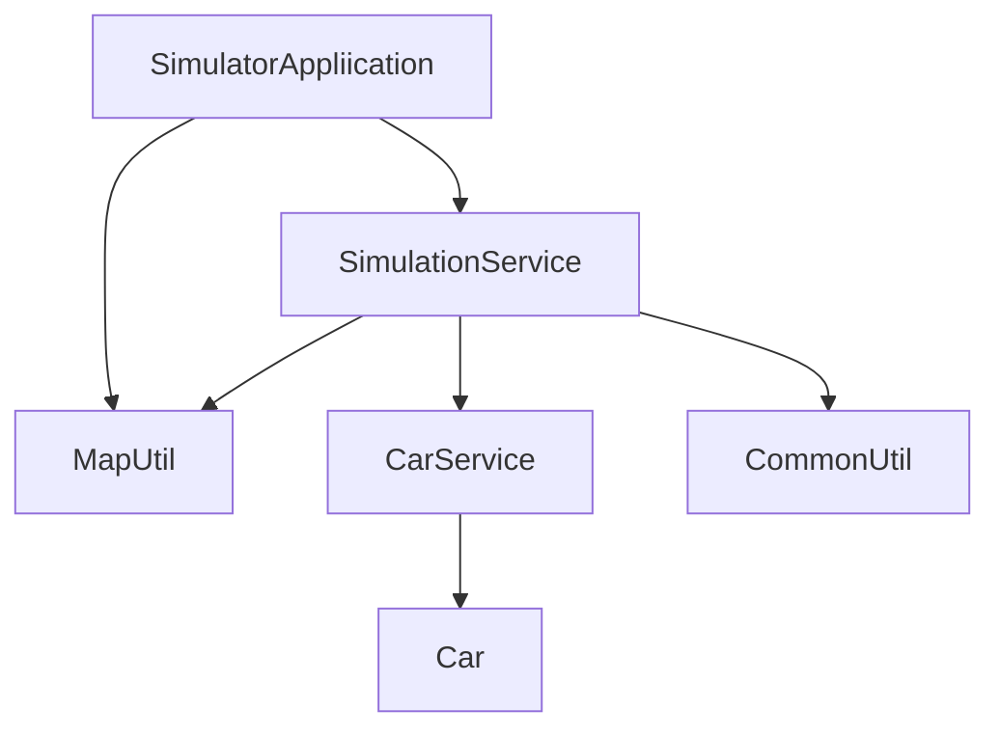

# Simulator game

This assessment is developed using Java integrated with Maven. The project, named simulator follows an MVC (Model-View-Controller) framework, consisting of presentation, service, and model layers. The simulation begins with the SimulatorApplication which invokes the SimulationService to execute the simulation and manage user input.

The SimulationService utilizes the CommonUtil to handle user input and validation. These validations are commonly used, and by encapsulating them within a static class, the utility methods can be accessed without requiring object instantiation, thereby reducing memory overhead and enhancing global accessibility for method reuse. Apart from the CommonUtil, it also uses the MapUtil to convert data that are reserved for presentation in the map. The methods consist of converting direction to an integer so that the manipulation could be done with mathematical approach such as changing the direction of the car. Once the user input is collected, the simulator initiates the simulation, prompting the invocation of the CarService to manage car movement.

CarService manages all car movements, separating them from the simulation logic. The package offers functionalities for simulating car movement within a defined boundary, ensuring collision and proper direction handling. Subsequently, the service updates the Car model with the current state of each car, including its attributes.

Car represent the entity of a car and facilitates the simulation of individual cars. During simulation, the class tracks the car's current state, including its position, direction, and progress through executing commands.

## Flow



## Files

| Layer        | Class                     | Folder    |
| ------------ | ------------------------- | --------- |
| Presentation | SimulatorApplication.java | .         |
| Service      | CarService.java           | ./service |
| Service      | SimulationService.java    | ./service |
| Model        | Car.java                  | ./model   |
| Util         | CommonUtil.java           | ./util    |
| Util         | MapUtil.java              | ./util    |

## Environment

Built: Mac OS
Support: Mac OS, Linux

## Requirements

```
1. Apache Maven 3.9.6 (bc0240f3c744dd6b6ec2920b3cd08dcc295161ae)
2. openjdk version "11.0.22" 2024-01-16
3. Docker version 25.0.3, build 4debf41 (optional, used to run using docker)
```

## Run Project

```
### jar
# build and run project
sh run.sh

# build project without scan and test
mvn -Dmaven.test.skip=true -Ddependency-check.skip=true  install

# build project with scan and test
mvn clean install

# run project using jar
mvn exec:java -Dexec.mainClass="tehpeng.simulator.SimulatorApplication"

# run test
mvn clean test

### docker
# build project
docker build . -t simulator:latest

# run project using docker image
docker run -it simulator:latest

# debug docker built image
docker run -it  simulator:latest /bin/sh
```

## Testing Approach

Test-Driven Development (TDD) approach was used throughout the development process and is particularly crucial in the initial phases. The methodology commenced with the establishment of a test scenario named 'givenScenario1Mock_whenRunSimulation_thenReturnCarAResult,' where in the service and class components were mocked, with the exception of the Util class. This test case enabled me to meticulously plan the methods and objects required before proceeding with actual development. Furthermore, this test case was augmented with more mocks after the class file was created hence, there is only one test case with mock. After ensuring that the class was coded and behaved as intended, I proceeded to create additional test cases dedicated to individual methods. Subsequently, individual tests were crafted to validate both typical behaviors and extreme cases, such as boundary conditions and specific scenarios like turning left from a north-facing direction (where the integer equals 0). By adhering to TDD principles, I ensured that each component's functionality was thoroughly tested by ensuring that the code coverage is well covered above 90% (Jacoco) throughout the development to ensure that when new methods does not change the outcome of the previous method.
